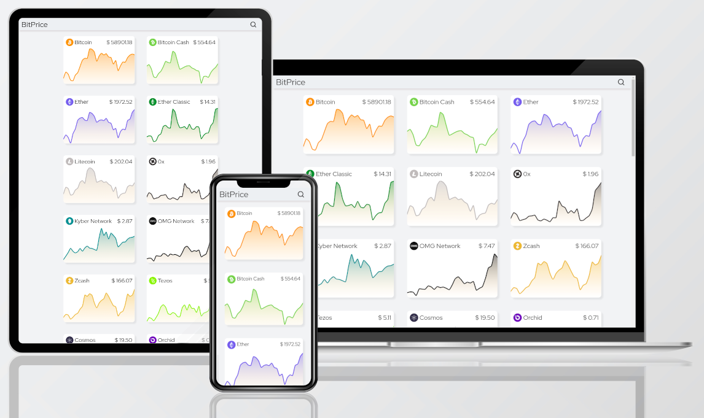

# [Bitprice](https://cryptobitprice.herokuapp.com/)

## Topics

[About Bitprice]()

[Technologies]()

[Installation]()

[License]()

## About Bitprice

  

A simple web application used as my final project of [CS50x](https://cs50.harvard.edu/x/2020/). It is written in flask and shows the current price of some criptocurrencies and its price in the last 30 days.

## Technologies

## Installation

## License